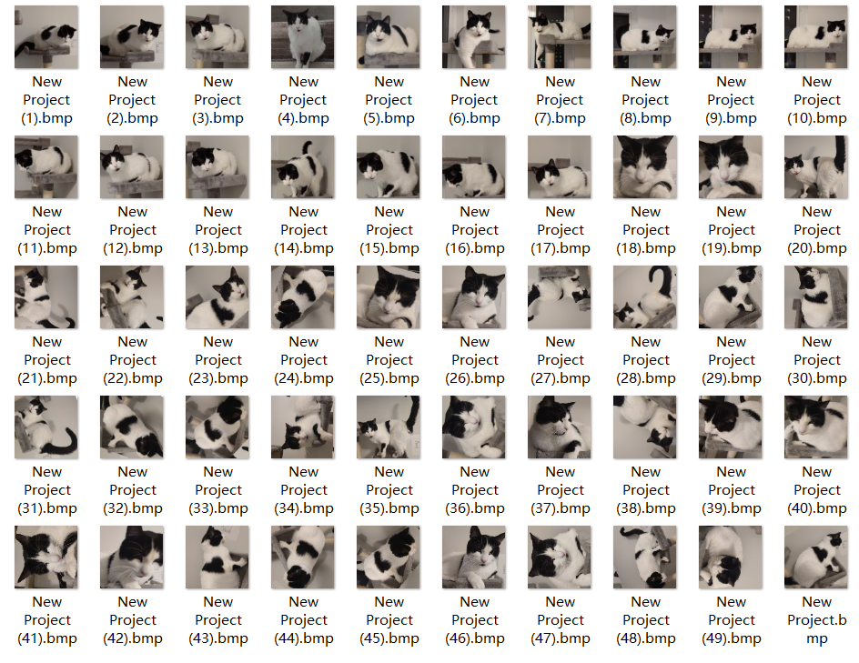

# object_detection_with_raspberrypi
***I'd like to give very special thanks to Mr.ShawnHymeL for great lectures.***  
 ## Reference
 Learned from "Computer Vision with Embedded Machine Learning" by Shawn Hymel on Coursera.  More details check below:  
  [1] ShawnHymeL's repository .   [ [Source code]( https://github.com/ShawnHymel/computer-vision-with-embedded-machine-learning.git) ]

## Introduction
This program is part of the CEG4912 project which is designed by **Group 2 of Section F00 for 2021 Fall Term**. Two cameras are used to monitor the EDM.One of the cameras will use an intelligent algorithm to identify the input numbers.The program will send an error signal when any error input is detected. 
## Components
* Raspberry Pi 4
* Pi camera
* USB web camera
## Procedure
1. Collecting Data
2. 
## Documentation
* numPy.py: Conversion between image and array.
* capture_pi.py: Capture 1 image with pi camera.  
script " for i in {1..10}; do python capture_pi.py; done " to capture 10 images.
## Collection Data
These datas are needed to train the program.
### Dataset Collection Checklist
- [x] 50 images of the same object for each class
- [ ] 3-4 classes for the problem
- [ ] Shapes will be very different between calsses
- [x] Scale photos to 96x96 pixels
- [x] Bitmap or PNG format
- [ ] Similar distance, position, lighting, and background
### Example

## Index
#### Updata python3 on Raspberry pi:  
1. sudo apt install python3 idle3
#### Update-alternatives:
2. sudo update-alternatives --install /usr/bin/python python /usr/bin/python3 10
#### Some programs
1. VS code: sudo apt upgrade code
2. Pip: sudo apt-get install python-pip
3. NumPy: pip install scipy
4. Opencv2: pip install opencv-python==   
notes: Need to install one package: sudo apt-get install libatlas-base-dev
5. Picamera: pip install picamera  
notes: Cannot install picamera on Windows System.
6. Tensorflow and Keras: pip install tensorflow

